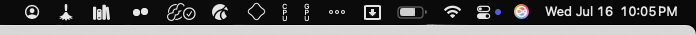

## Installation done !

Your Mac is now hopefully setup. It some steps failed, execute them manually to complete the setup.

You will nedd to complete these steps manually :

- Set the default browser
- Enter licence key for these apps : _Eagle_, _TabTab_,
- Install these apps:
  - _Bartender 5_
  - _CleanShot X_
  - _Affinity Designer_
  - _Affinity Photo_
  - _Dropzone 4_
  - _Framous_
  - _Hazel_
  - _Little Snitch_
  - _Mediamate_ (or open source equivalent)
  - _Swish_
- Install these fonts : _Berkeley Mono_

### After installing Bartender

The menu bar should look like this :

### Miscellaneous

- Wallpaper is from Resend Raycast extension
